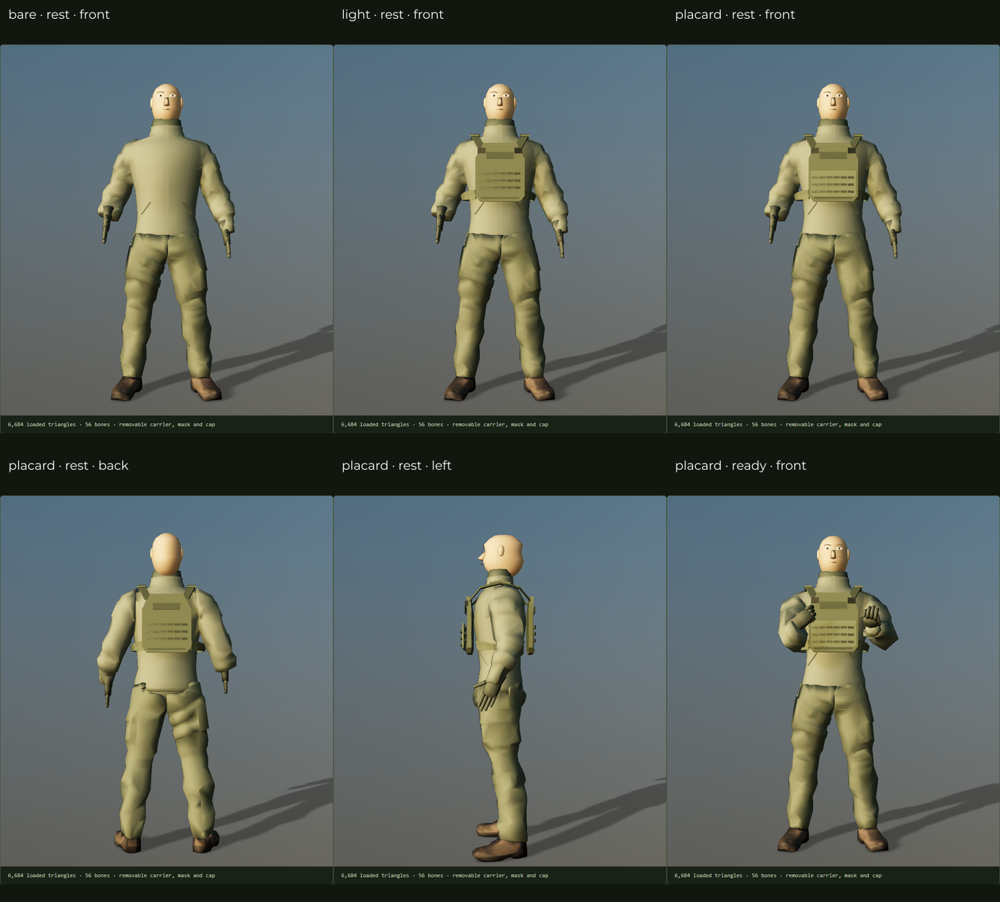

# Recon lightweight plate carrier

WP-CM5, 6 October 2026. The clean Recon now accepts an independent lightweight carrier with closed front/rear plate bags, shoulder straps and pads, buckles, a fitted cummerbund and a removable front placard. Compare **Clean clothing**, **Lightweight carrier** and **Carrier + front placard** in the [foundation inspector](../../operator/foundation.html) or [Operator Modder](../../operator/index.html#base=recon-modular&carrier=placard).



## Asset and fit

The new pack is **1,116 triangles** across eleven authored mesh nodes, below its 1,700-triangle allocation. The unchanged CM3 body plus the complete loaded pack totals **6,684 triangles**. Removing equipment restores the original complete jacket; no body coverage mask is used. The foundation remains hood-free with the existing broader chest and neck.

Plate bags have tapered upper corners and curved depth, front/rear webbing, reinforcement hems and hook-loop patches. Straps and shoulder pads are distinct closed volumes. The low side bands taper beneath the arms; their right-side clearance reflects the source body's asymmetric sleeves. The front placard has its own webbing and material. These are new authored meshes, not source-vest visibility fragments. Magazine, utility and radio pouches are CM6 work and are not represented as finished equipment here.

Four deterministic 256-pixel woven colour maps supply fabric, webbing, hardware and placard. The Modder exposes independent fabric/webbing/placard finishes and preserves texture detail. The hardware remains separately shaded. All primitives of each multi-material module retain their parent part identity after rebinding, so removal includes its webbing and trim.

The pack retains the canonical 26-bone rest frames and binds to the foundation's actual bones by name. Plate bags and straps use torso weights sampled from the jacket, excluding arm influence; side bands use the authored spine blend. The build checks rest matrices and hashes the body before and after generation. No foundation, source Recon or original-comparison geometry is modified.

## Carrier pose profile

`reconCarrier` inherits the foundation's fingers and local bone conventions. Its data in `operator/poses.json` adjusts held-rifle positions and elbow poles for the added chest depth, plus small right-arm offsets in relaxed/salute poses. The Modder selects it only with the carrier equipped and restores `reconFoundation` on removal. Profile inheritance rejects cycles.

The inspector uses the reference rifle's grip frame for carry poses even while the rifle is hidden, matching the intended wrist/elbow placement rather than displaying incomplete arm angles. Actual weapon geometry and each rifle's support-grip distance are still checked separately in the Modder. The existing Recon keeps its own pose profile.

## Assembly definitions and attachment surfaces

[recon-carrier.json](../../operator/recon-carrier.json) contains the asset-backed body/carrier/placard definitions and three CM4 assemblies. The inspector resolves these before applying visibility. The Modder retains its familiar slot interface and existing URL format; CM8 will introduce the full assembly editor.

Carrier cost conservatively charges the entire loaded pack, including a hidden placard. The placard selects geometry already owned and loaded by this carrier, so it adds zero triangles to that assembly rather than double-counting them. Its unique `light-placard` attachment type prevents accidental placement on unrelated carrier definitions. Detaching the carrier removes its placard child as well. The runtime display's visible-triangle number remains distinct from the full loaded allocation.

Front and rear attachment grids use six columns and three rows with 39 mm spacing, defined in their parent's asset-rest coordinates. The rear frame faces backward. Cell dimensions, outward depth bounds and footprints are validated by CM4; they are not unrestricted drag handles. These grids reserve fitted locations for CM6. Pouch skin binding and posed attachment clearance must be implemented and verified with the actual CM6 pouch meshes; this milestone does not claim that arbitrary future pouches fit.

## Rebuild and acceptance

```sh
npm run assets:recon-carrier
npm run test:carrier
```

Set `BLENDER` to Blender 4.4 and `CHROMIUM` to Chrome when they are not on PATH. `build-recon-carrier.py` is the editable authoring source; its generated `.blend` stays in ignored `build/`. The JS wrapper decodes the body reference, runs Blender, optimizes the pack and emits measured manifests, fit metadata and catalogue definitions. `CARRIER_SHOT` selects the browser contact-sheet destination; by default it writes `build/recon-carrier-sheet.png`.

Asset tests check the compressed pack's closed volumes, normalized weights, bone rebinding, conservative assembly cost and clean removal. They sample carrier vertices against the closed posed jacket in ten reference poses. Browser acceptance checks all three carrier modes, saved state and 24 held carries: AK-74M, G3 and AK-15K in eight poses, including hand reach, rifle penetration and carrier/jacket contact samples. These checks use a 5 mm garment-contact tolerance; they do not certify every triangle crossing, attachment build or transition frame. Wider outfit/performance coverage remains CM9.

Next: **CM6**, independent magazine, utility and radio pouches, mounted through the authored surfaces with occupied-cell validation and owned radio/cable geometry.
