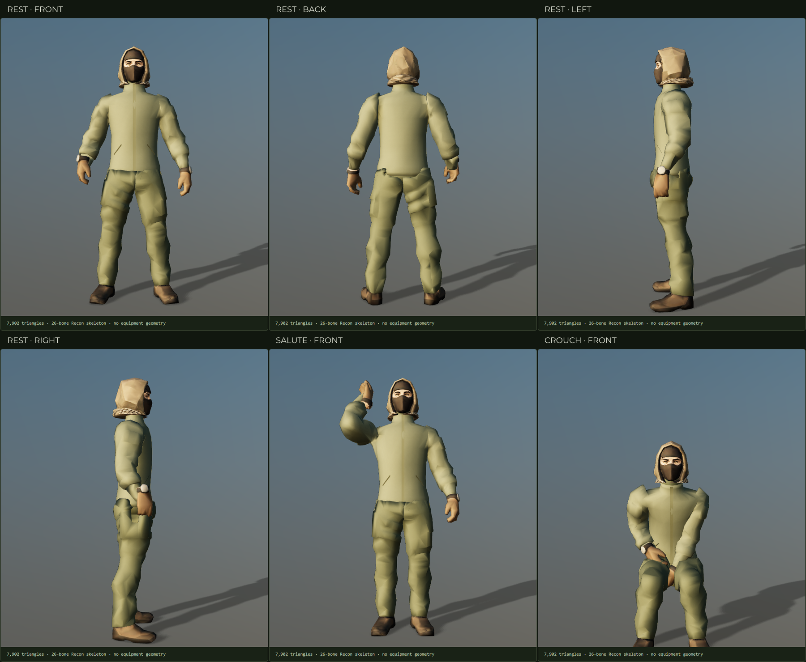

# Recon clean clothing foundation

WP-CM2 completed 5 October 2026. The [foundation inspector](../../operator/foundation.html) shows the body without equipment from four sides and through the pose/idle library. Select **Recon · foundation** in the [Operator Modder](../../operator/index.html#base=recon-modular) to change clothing colours and test carried rifles. This is the underlying clothing milestone; new carriers, bags and the assembly editor remain later packets.



## Shipped result

- Rebuilt the missing front/back torso as a complete field jacket, with collar, hem, zipper placket and two welt pocket mouths. Sleeve roots are joined into the jacket rather than hidden beneath shoulder equipment.
- Repaired the source-inspired trousers, boots and right cuff; added a finished waist and neck under the temporary head. The vest, harness, shoulder tabs, knee pads, holsters and bags are absent from this asset.
- Jacket, trousers, cuff, waist and neck have fresh woven albedos and new UVs. No equipped-source projection is used for those cloth surfaces. The source head/hood, gloves and boots retain their existing atlas and face protection.
- Preserved all 26 canonical bone names, parents and local rest transforms. Shoulder heat weights blend through the continuous garment; sleeve rims follow the wrist frames to prevent gaps during grip rotation.
- Added a foundation-specific pose profile and measured grip orientation. Raised-rifle and two-handed carry positions are fitted to this garment. The existing Recon remains the default, with its original model and pose profile unchanged.

| Runtime allocation | Triangles |
|---|---:|
| Continuous jacket and sewn details | 1,324 |
| Trousers and finished waist | 1,392 |
| Boots | 512 |
| Right cuff and neck | 158 |
| Temporary head/hood/mask | 4,000 |
| Temporary fixed-finger gloves | 516 |
| **Complete foundation** | **7,902 / 8,000** |

The compressed GLB is 1,261,764 bytes. It leaves 7,098 triangles within the 15,000-triangle operator-plus-equipment ceiling; the resolver must account for the actual equipped total. The retained head consumes roughly half the body allocation and is deliberately scheduled for CM3.

## Rebuilding and authoring

Run from the repository root with Blender 4.4 available as `blender`, or set `BLENDER` to its executable path:

```sh
npm run assets:recon-foundation
npm run test:foundation
```

`tools/assets/build-recon-foundation.mjs` checks the pinned canonical Recon hash, decodes meshopt for Blender, runs the authoring script and uses the existing optimisation pipeline. It rejects changed bone frames, budget overflow, or triangle loss during export. The current and complete-original assets are not rewritten.

`tools/assets/build-recon-foundation.py` and `recon_foundation_geometry.py` are the editable authoring source. They build the torso/waist/neck, repair retained silhouettes, generate deterministic cloth textures, assign skin weights and export. The generated editable Blender scene is `build/recon-foundation.blend`; it is a reproducible local authoring intermediate and is not committed. Runtime files are `recon-modular.glb`, its manifest and `recon-modular.foundation.json` under `assets/models/operators/`.

The trouser rebuild removes disconnected remesh debris before decimation so tiny cap islands cannot collapse into invalid duplicate faces. Boot seams are welded before export. The jacket uses a 4 mm voxel union and 1,300-triangle reduction, followed by armature heat weights, wrist-rim constraints and normalized four-weight skinning. The foundation report records authoring bounds in Blender coordinates (+Z up, −Y forward); the runtime retains the contract's +Y up, +Z forward frame and 1.85 m height.

## Acceptance and limits

`tests/recon-foundation.test.mjs` loads the compressed runtime asset and checks the exact skeleton contract, triangle/hash metadata, absence of equipment, position-welded closed clothing volumes, front/back/waist coverage, normalized skin weights and bounded deformation across every pose and idle. The thin zipper and welt overlays intentionally are not closed volumes.

`tests/e2e/recon-foundation.mjs` checks decoded cloth and face textures, four inspection directions, pose/rest reset, idles and reduced motion, keyboard orbit, wireframe, mobile overflow and serious/critical accessibility violations. It tests AK-74M, G3 and AK-15K in eight held poses (24 combinations), using actual deformed jacket/hood geometry for clearance and a 25 mm palm-target tolerance. Colours and the shared URL survive reload, and switching back to the current Recon restores its equipment. Set `FOUNDATION_SHOT` to save the six-panel inspection sheet.

These checks cover sampled weapon vertices in held poses; they do not certify every attachment, every transition frame or future equipment fit. The head/hood/mask are still fused, fingers cannot articulate, and the source-derived limb silhouettes remain coarse. CM3 separates headwear and rebuilds the hands; CM4 supplies the item resolver before CM5 introduces the first removable carrier.

The latest fetched `origin/main` is `17eb192`, with concurrent operator and game changes. This milestone stays isolated on `codex/generated-operator-equipment`; integration must reconcile those changes deliberately. The inherited site-size and downloader-test failures are tracked in the handoff rather than folded into this geometry packet.
