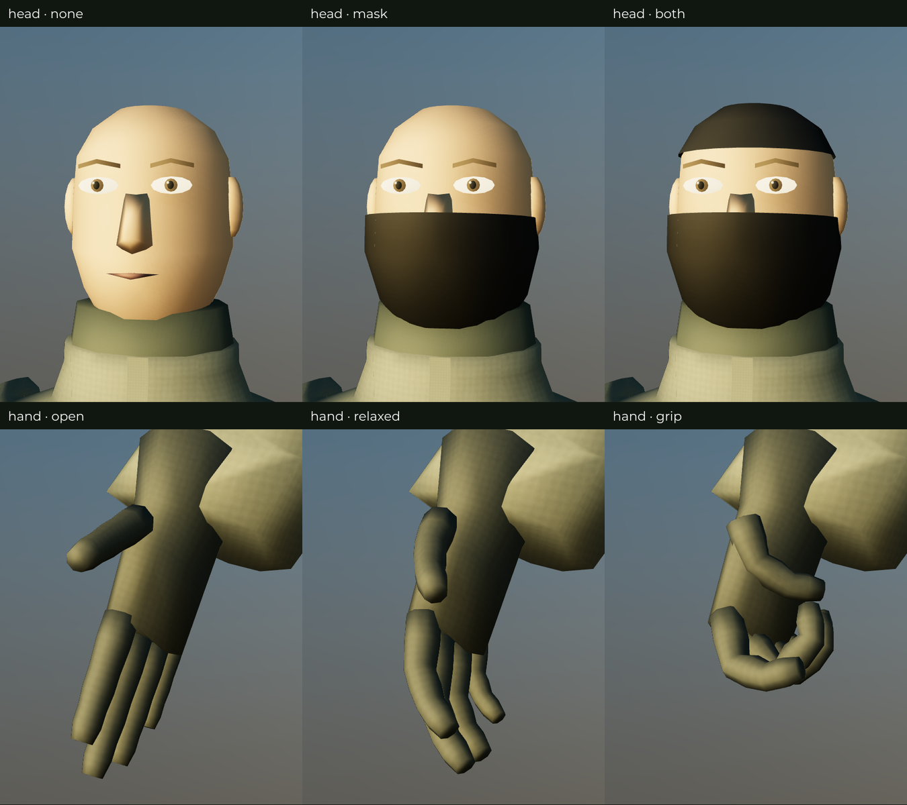
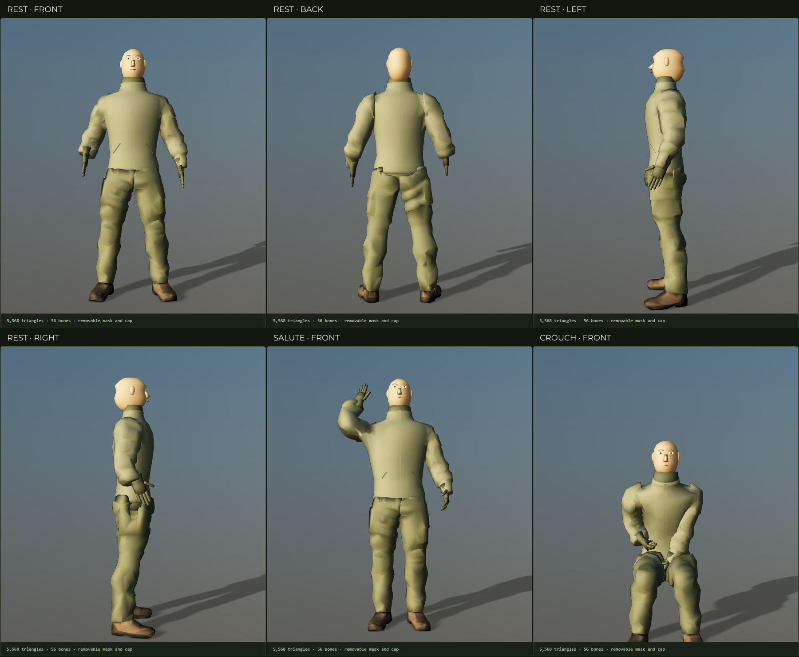

# Recon removable headwear and articulated hands

WP-CM3, 5 October 2026. The [foundation inspector](../../operator/foundation.html) now exposes bare head, mask, cap and combined views, plus open, relaxed, rifle-grip and support-hand shapes. The [Operator Modder](../../operator/index.html#base=recon-modular) saves mask/cap choices with the outfit and selects finger shapes for each pose.



## Geometry and rig

The body keeps the owner's hood-free silhouette, broader chest and fuller neck from CM2. The new head has a complete skull and jaw, nose, lips, ears, sclera, iris, pupil and brows beneath separate cloth mask and fitted cap meshes. The source eye strip included long hood-trim triangles and painted fabric: cropping it left visible cut edges. The uncovered head therefore uses newly authored, stylized facial geometry and flat skin/eye materials. The original textured Recon remains available unchanged for comparison. The outer hood is not reintroduced.

Both gloves are newly authored cuff/palm/finger meshes, 600 triangles per hand. Rounded knuckle ridges overlap all five finger roots. Three joints per finger provide independent phalanges; the thumb opposes across the palm rather than folding toward the wrist. Cuffs and existing sleeve-rim constraints meet the unchanged wrist frames. Finger surfaces are deliberately simple low-poly forms; they are not a scanned anatomical hand.

The complete loaded asset, including mask and cap, is **5,568 triangles** against the 8,000-triangle body allocation. Hiding accessories does not subtract them from budget accounting. The gloves use 1,200 triangles rather than the initial 900-triangle planning target; the compact head leaves the complete body below its allocation.

The versioned `recon-v2` extension has **56 bones**. All 26 `recon-v1` names, parent relationships and local rest matrices are preserved. Thirty new joints use `{thumb,index,middle,ring,pinky}_{01,02,03}_{l,r}`, parented beneath their existing hand. The export writes the new joints and matrices to [recon-modular.rig.json](../../assets/models/operators/recon-modular.rig.json). The builder rejects missing legacy bones, changed rest frames, unexpected additions or incorrect finger parents.

Measured palm targets are `[0, 0.078, 0.024]` metres in each hand's local frame. The shorter gloves require a small raised-rifle placement adjustment; the other tested carries retain their positions.

## Pose data and authoring

`operator/poses.json` contains the foundation's four hand shapes and per-pose choices. The pose resolver expands those shapes into finger-bone rotations, suppresses the legacy whole-hand curl macro for that profile, and explicitly marks finger rotations as local. Existing profiles continue using character-space rotations. This allows the same finger closure to follow a wrist positioned by weapon IK.

`tools/assets/recon_foundation_hands.py` authors the gloves and finger hierarchy. `recon_foundation_head.py` authors the complete head and removable coverings. The existing foundation command runs both, exports meshopt-compressed geometry, validates the skeleton extension and records measured counts:

```sh
npm run assets:recon-foundation
npm run test:foundation
node tests/e2e/recon-head-hands-sheet.mjs
```

Set `BLENDER` to the Blender executable when it is not on PATH and `CHROMIUM` to Chrome for browser checks. The detail-sheet command writes `build/cm3-detail.png`; `FOUNDATION_SHOT` sets the full-body sheet output during the foundation browser test. Editable generated scenes stay in ignored `build/recon-foundation.blend`; the scripts are the committed authoring source.



## Verification and remaining limits

The runtime-asset tests verify all legacy transforms, every new finger parent/matrix, joint influence on glove vertices, thumb opposition, closed clothing/skull volumes, normalized weights and all pose/idle samples. Browser acceptance exercises every headwear and hand-shape control, palette/headwear URL reload, keyboard, reduced motion, mobile layout and accessibility. AK-74M, G3 and AK-15K each pass eight held carries with measured palm reach and jacket/head clearance.

Weapon checks sample held poses; they do not certify every attachment or transition frame. The face is a stylized base for later identity work, without facial-expression or lip-sync animation. CM4 supplies the item-instance/compatibility resolver next; CM5 can then introduce the first modular carrier against this body. Main remains protected; this work stays on the feature branch.
