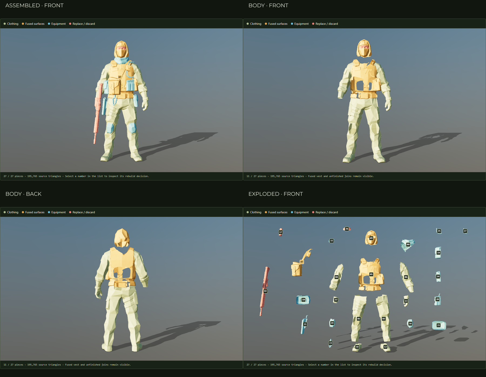

# Recon modular source audit and authoring contract

WP-CM1 completed 4 October 2026. Inspect the [interactive teardown](../../operator/teardown.html), the [original/current comparison](../../operator/compare.html), and the [machine-readable contract](../../tools/assets/recon-modular-contract.json). This deliverable establishes the reconstruction boundaries; it does not ship a clean body or new carrier.



## Measured baseline

| Asset | Triangles | Texture | Finding |
|---|---:|---|---|
| Complete inbound reference | 193,534 | Original 4096² | Best reference for surface appearance and face. Preserve unchanged. |
| Split inbound reference | 195,765 | Diagnostic colours in teardown | 27 pieces; open boundaries on every piece. Segmentation is not a finished modular asset set. |
| This branch's existing conversion | 14,523 | Shared 2048² atlas | 26-bone skeleton, repaired complete-source head, face material protected from clothing tints, corrected hand frames. |
| Upstream conversion at `285b45bfd4447ea29744d3fe932fd0cd987199e5` | 11,253 | Shared 2048² atlas | Separate colour bake, split eye material still present; both hand rest orientations differ. Other 24 bones match. |

The [audit JSON](../../assets/models/operators/recon-source-audit.json) records SHA-256 hashes, source bounds, per-piece triangle and boundary counts, both runtime mesh allocations, textures, materials, and local/world matrices for every bone. The source inspection GLB is byte-identical to the inbound split model (5,020,948 bytes). Display parents apply scale 1.85, rotation −90° around Y and translation +0.925 m in Y. Explosion changes only new parent transforms.

Boundary counts use positional welding rounded to 0.000001 m, then count triangle edges with one incident face. They reveal open cuts, not a diagnosis that every edge must be capped. In particular, preserve facial UV seams and intended garment openings; indiscriminate caps caused the earlier face problem. The inspector uses double-sided diagnostic materials to expose the cuts. That is not a substitute for complete production surfaces.

## Reuse and reconstruction decisions

View numbers are one-based; source IDs and script indices are zero-based. “Reuse and fit” means preserve useful shape, then repair surfaces, rebuild UVs as needed, reduce triangles and validate fit. No raw split part is declared production-ready.

| View numbers | Source IDs | Surface | Decision |
|---|---|---|---|
| 01, 03 | 0, 2 | Trousers | Reuse silhouette; reconstruct waistband, crotch and knee coverage where segmented. |
| 04, 06, 22 | 3, 5, 21 | Sleeves / right cuff | Repair shoulder and wrist joins to the new torso. Part 21 is only a cuff, not a right hand. |
| 05 | 4 | Jacket and vest | Rebuild. Vest thickness, panel edges and belt-like relief are fused into the torso. It has 30,192 source triangles and 2,070 boundary edges. |
| 07 | 6 | Harness and front satchel | Rebuild straps and bag as separate assets. Shared mesh currently combines both, with 515 boundary edges. |
| 08 | 7 | Scarf | Repair inner surfaces and fit over a complete neck. |
| 09, 26 | 8, 25 | Hood, mask/head and eye fragment | Rebuild separate head/neck, hood and mask using the complete textured model as reference. Replace the split eye fragment. |
| 02, 13 | 1, 12 | Fused rifle/right hand and left glove | Rebuild both articulated hands. Keep the current glove outline as a scale reference; use Workbench weapons. |
| 12, 18 | 11, 17 | Boots | Reuse silhouette; repair ankle joins and soles. |
| 10, 14, 19 | 9, 13, 18 | Belt and utility pouches | Reuse shape language; create closed backs and separate attachment interfaces. |
| 20 | 19 | Magazine cluster | Rebuild a repeatable single pouch plus contents; do not retain a fixed cluster. |
| 11 | 10 | Holster | Repair shell; separate thigh straps and belt adapter with leg-following fit. |
| 21 | 20 | Back pouch | Small bag reference; author complete back and separate strap paths. |
| 16, 24 | 15, 23 | Knee guards | Repair backs, add fitted straps and check bending. |
| 23 | 22 | Carabiner | Complete small accessory with a real parent clip point. |
| 25, 27 | 24, 26 | Radio and badge | Separate radio/pouch; consolidate radio details and parent cable/antenna to radio. |
| 15 | 14 | Shoulder tab | Replace as part of a complete carrier shoulder assembly. |
| 17 | 16 | Floating rifle fragment | Discard from the character. |

The rendered front/back strip inspection confirms large torso holes below the vest, the absent neck, and the missing right hand. The trousers also retain integrated pocket shapes; treat those as garment details unless an equipment item is explicitly being made removable. The number list and isolated view are the detailed reference for small pieces in the exploded sheet.

## Canonical source and texture decision

Use the complete inbound model for proportions, visible fabric treatment and facial appearance. Use split parts as reconstruction guides, not as the final item boundaries. Preserve both inbound files and the comparison assets byte-for-byte.

Use this branch's corrected 26-bone rest skeleton as `recon-v1`. Its protected `M_GR_Face` and original-face-UV bake remain the baseline for face appearance. The current 4,000-triangle combined head is a reference, not the new head budget. New underlying cloth requires new UVs and clean albedo; projecting the original vest or harness onto exposed cloth would preserve unwanted gear marks.

The upstream model was inspected through `git show` at the pinned commit; no checkout, branch merge or asset replacement was performed. Keep upstream's unrelated game work intact. During later integration, retain its non-character changes, reconcile the character importer and UI changes explicitly, and rebuild `recon-modular` through its own exporter. Do not replace either existing conversion with an unreviewed binary or apply an old whole-body bake over the protected face. Existing `generated-recon` links and the original comparison remain valid.

## Skeleton, seams and module ownership

Contract v1 is an authoring contract, not a newly available runtime base. Coordinates are metres, +Y up, +Z forward and +X the character's left. Reference standing height is 1.85 m. glTF matrices are column-major; the audit's `current.bones` table is the exact reference to 1e−5 tolerance.

Preserve all 26 names, parents and rest transforms, including `hand_l` and `hand_r`. Hand local +Y follows wrist to knuckles; +Z is the inward palm normal. Existing palm offsets are recorded only for legacy compatibility; measure new offsets after remodelling gloves. CM3 introduces `recon-v2` with additional thumb/finger joints, using `{thumb,index,middle,ring,pinky}_{01,02,03}_{l,r}`. New joints are descendants of existing hands. Do not re-roll, rename or reparent legacy joints. Any incompatible rest change requires a separate major contract and pose migration.

The jacket owns the complete torso and sleeves, including surfaces beneath armour; trousers own waistband, crotch and legs. Boots overlap a finished ankle seam; gloves overlap finished cuffs. CM2 authors those loops against the preserved rest skeleton and records vertex positions/overlap tolerances after geometry exists. CM3 completes the head/neck and separates the hood and mask. A neck under a scarf must be geometry, not empty coverage.

Carrier plate bags, shoulders, cummerbund and placard belong to the carrier assembly. Pouches belong to a carrier/belt/bag mount, never to an anonymous scene root. Holster adapters distinguish belt ownership from thigh deformation. Bag straps are owned by the bag with separate authored routes for bare clothing and supported carriers. Hood, mask, scarf and eye/skin material regions remain separately controlled.

Mount transforms are parent-local, position in metres, quaternion `xyzw`, unit scale. Mount surfaces use +X for columns, +Y for rows and +Z outward. A rear surface rotates its frame rather than changing the meaning of these axes. Every item needs stable ID, skeleton/fit profile, owner, mount type, footprint, exclusions, coverage, material regions and measured triangle count. Placement uses discrete validated cells with a bounded authored depth offset. CM5–CM7 establish actual surface dimensions and clearance values from completed geometry; this audit does not invent fit coordinates.

Removing an owner removes its children from the active assembly, with undo restoring the subtree. Repeated pouches are independent instances. Coverage masks are optional rendering optimisation after strip validation; they must never conceal unfinished surfaces. New appearance data must not grant inventory, protection or storage capacity.

## Geometry allocation

The current conversion spends **11,629 triangles on body/clothing and combined hood/head**, and **2,894 on equipment**, leaving only **477** beneath the 15,000 cap. Its jacket/sleeves/cuff consume 3,563, trousers 2,980, boots 522, gloves 516, combined head 4,000 and collar 48. These are measurements, not clean-body counts: the jacket still contains vest surfaces.

| New assembled allocation | Target triangles |
|---|---:|
| Complete body and clothing | 8,000 |
| Carrier | 1,700 |
| Pouches, including repeated instances | 1,400 |
| Belt | 450 |
| Bag and straps | 1,450 |
| Optional headwear | 650 |
| Small kit | 350 |
| Reserve | 1,000 |
| **Total** | **15,000** |

Inside the 8,000 body target: jacket/sleeves 2,600; trousers 1,800; boots 600; gloves 900; head/neck 1,700; seam reserve 400. CM2 must reduce/rebuild the body rather than add another carrier over the old 14,523-triangle asset. Optional hoods draw from headwear; masks and face join budgeting are resolved with CM3. The assembly resolver counts actual combinations, including repeats and hidden loaded geometry. Weapon budget stays separately at 30,000. The two high-resolution source references are inspection exceptions, never gameplay outfit assets.

## Reproduce and continue

```sh
node tools/assets/audit-recon.mjs --upstream 285b45bfd4447ea29744d3fe932fd0cd987199e5
node --test tests/recon-audit.test.mjs
npm run test:teardown
```

`TEARDOWN_SHOT` may point to an output PNG to create a four-panel sheet: assembled front, body candidates front/back, numbered explosion. On Windows set `CHROMIUM` to the installed Chrome executable. The audit intentionally pins source/current hashes: a future model change requires an explicit audit update, not silent acceptance.

CM2 is next: build the clean jacket, trouser/boot/cuff seams and complete torso surfaces in an opt-in authoring output. Verify front, back, sides, waist and shoulders with every item removed; retain the source comparison. Do not copy baked equipment shadows onto the new clothing. CM4 can then use this contract to implement the renderer-independent item resolver. New carriers follow the CM2/CM4 gates.

Verification: four asset/contract unit tests and the browser teardown acceptance pass. Browser checks independently compare glTF bounds with audit coordinates, verify exact transform/geometry restoration after separation, selection/isolation, body filtering, keyboard camera, wireframe, mobile overflow and axe accessibility. The rendered sheet was inspected: fused vest, torso holes, missing neck/right hand, and all 27 numbered pieces are visible. Source geometry and the working operator conversion are unchanged.

The built-site teardown and original comparison pass, as do site/link validation, ESLint, the repository's configured TypeScript checks and changed-JavaScript formatting. The built site is 244.4 MB, above the inherited 90 MB target; this packet adds a 5 MB inspection reference and does not claim to resolve the existing size overrun.
