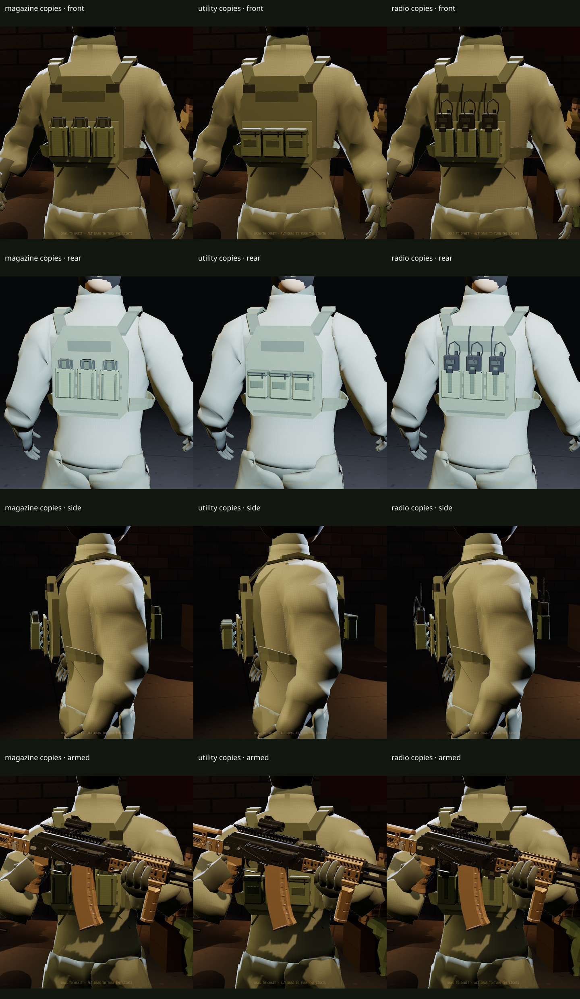

# Recon mounted pouch modules

WP-CM6, 7 October 2026. The clean Recon accepts independent magazine, utility and radio/cable modules in three front and three rear positions. Start with **Patrol carrier** in the [Operator Modder](../../operator/index.html#base=recon-modular&carrier=placard&front1=magazine&front2=magazine&front3=utility&rear1=radio&pose=ready).

The final merged contact sheet is captured by the cloud browser acceptance below. The integration preserves main's current Hero, Relaxed and Ready pose library.



## Geometry and mounting

The mount-local templates are closed volumes with retained UVs: magazine **264**, utility **220**, radio/cable **376** triangles, **860** in the loaded template pack. Fabric and straps retain their 128-pixel woven textures when recoloured. The small dark hardware material is flattened by the optimizer. The magazine includes its sleeve and retention cord; the utility bag includes its lid, zipper and pull; the radio owns its sleeve, antenna, cable, display and controls. Removing a copy removes all of that copy's primitives.

The radio display now uses a 0.5 mm bevel on its 2 mm thickness. The previous half-thickness bevel collapsed sixteen triangles in the compressed export. Authoring checks reject degenerate triangles; runtime tests retain positional-weld closure checks and verify the exported model hash. Blender 4.3.2 was validated in the cloud, alongside the earlier 4.4 authoring setup.

Each copy occupies two columns by three rows of its parent's measured 39 mm grid. `pouch-slots.js` exposes six fixed, non-overlapping positions; the assembly resolver still rejects overlapping or incompatible assemblies. Front choices need the placard; rear choices need a carrier. Removing an owner hides its descendants while preserving their slot selections for restoration. The free assembly editor, undo/redo and versioned outfit migration remain CM8.

The template backs are seated within 2 mm of the outer webbing. `mounted-pouches.js` captures the real carrier surfaces before posing, dequantizes exported positions, transforms each copy from its mount frame, interpolates skin weights from nearby triangles, and binds it to the body's rest inverse matrices. Rear frames face backward. Copies have distinct identities, share materials, and dispose obsolete instance geometry when the outfit changes. Pose and colour changes keep the mounted geometry.

## Poses, persistence and controls

The `reconPouches` profile in `operator/poses.json` inherits `reconCarrier` and its foundation/finger contract. It retains the earlier extended-pose and slung fit data. Main now exposes Hero, Relaxed and Ready; the merged carrier profile moves the Relaxed hold 4 cm outward to clear the right sleeve without changing the bare foundation. The profile activates only while pouches are mounted. Removing every pouch restores the carrier profile; removing the carrier restores the foundation profile. Body, carrier, original Recon and comparison geometry are unchanged.

Pouch choices and colours round-trip in the existing shared-link format. Original fabric detail survives recolouring and restoration. Disabled controls explain their required owner. Keyboard focus survives a control redraw, and the six-slot panel fits a 390-pixel viewport.

## Budget

The template pack is below its 1,400-triangle allocation. Mounted instances are charged separately: the complete body/carrier allocation is **6,684** triangles; the Patrol preset adds **1,124** for **7,808** total. Six radios add **2,256**, giving **8,940**, with **6,060** remaining under the complete operator's 15,000-triangle ceiling. That extreme is supported, but exceeds the nominal pouch allocation by **856**; CM7 and later modules must use actual assembly totals instead of assuming each category's full allocation remains free.

## Rebuild and acceptance

```sh
BLENDER=/usr/bin/blender npm run assets:recon-pouches
CHROMIUM=/usr/bin/chromium npm run test:pouches
```

Editable Python authoring code and the build wrapper are tracked. Generated `.blend`, raw GLB, texture intermediates and logs stay in ignored `build/`. Runtime GLB, manifest, fit report and measured catalogue are tracked. Body and carrier hashes are checked during regeneration.

Acceptance covers:

- Five focused unit checks: topology/UVs/hashes, per-copy budgets and overlap rejection, pose-profile isolation, front/rear rest binding and webbing seating, ownership and geometry disposal.
- **27 held carries** on current main: three pouch types × three rifles (AK-74M, G3, AK-15K) × Hero, Relaxed and Ready, with six copies mounted. The branch previously tested 72 held and 36 slung cases before main retired the other poses; those historical checks do not describe the current UI.
- **19 motion samples** of the mixed outfit: three samples each of calm/alert/weary, three intermediate samples each toward Hero/Relaxed/Ready, and a reduced-motion sample.
- Removal/restoration, disabled controls, URL reload, original/recoloured texture persistence, keyboard focus and 390-pixel mobile layout.

Browser checks wait for a rendered frame rather than assuming a fixed delay is long enough on software-rendered cloud Chromium. Clearance retains the existing 5 mm garment-contact and 12 mm rifle-penetration tolerances, with a 25 mm palm-reach limit. These vertex samples and inspected contact views do not certify every triangle intersection, every transition or every rifle/loadout; expanded coverage remains CM9. The inherited site-size overrun is separate from this module.

Next: **CM7**, equipment belt and small daypack. Preserve the fitted carrier/pouch surfaces, actual per-instance budgets, finger frames and slung-rifle clearance when adding those modules.
