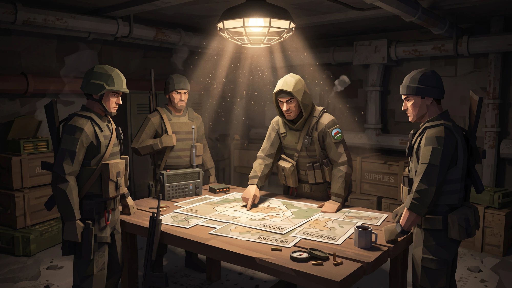

# Partisan Project master roadmap

**Partisan Project** · version 0.3.1 · consolidated 5 October 2026 · master index and generated work queue

This is the one index for every plan. The detailed plans live beside it and are linked from their tracks in §5:
[campaign](campaign-roadmap.md) (how the modules become one game), [tactical](tactical-roadmap.md) (inside a
mission), [graphics](graphics-roadmap.md) (the 2.5-D look) and [character customisation](character-customisation-roadmap.md).
The 30 September plan is kept for traceability in
[`archive/legacy-master-roadmap-2026-09-30.md`](archive/legacy-master-roadmap-2026-09-30.md).
Work is planned as **packets sized for two $20 subscriptions**, passed back and forth between windows: see
[`agent-ops/README.md`](agent-ops/README.md). The plan itself is data ([`agent-ops/packets.json`](agent-ops/packets.json));
the tables in §6 are generated from it.

> Links: [Design document](game-design-master-doc.html) · [Index](../) · [Campaign roadmap](campaign-roadmap.md) ·
> [Art direction](art-direction.md) · [Engineering standards](engineering/standards.md) · [Decisions (ADRs)](adr/README.md) ·
> [Design decisions](design-decisions/README.md)

## 1. What Partisan Project is

*Escape from Tarkov meets Mount and Blade with guns.* A squad-based PvE game: you lead a resistance band across an
occupied Mediterranean island, ambush convoys, raid compounds and defend your hideout, and every gun and plate you
steal levels up your fighters and your Resistance. The metagame escalates from small ambushes to open war with
vehicles until the Invader is driven off the island.

It is built as an **interactive game design document**: every part of the future game is a playable or inspectable
demo on the site, tied together by the in-universe [design document](game-design-master-doc.html) and a Nokia-style
index. The demos are now being joined into one game: the **campaign** (§5.8).

**The two showcase demos that must be excellent:** the **Weapon Modder** (a gun modder with many rifles and real
attachments) and the **Operator Modder** (fully customisable operators with hero poses). **The game:** the campaign
loop of world map, three missions, loot and upgrades.

## 2. Where we are (5 October 2026, v0.3.1)

| Module | State |
|---|---|
| **Weapon Modder** (`workbench/`) | **Live.** Eleven rifles from cleared sources: AK-74M, AK-15K, G3, M16A1, Mk 14 EBR, modernised RPK, SIG MCX Spear (plus a retro-textured variant), StG 44, PPSh-41, Bren, Chauchat. Real attachment parts, every rifle takes every attachment, a CNC furniture kit for the older rifles, rails that cannot overlap, stats and hover deltas, presets, finishes, camo, wear. Studio light over a baked warehouse panorama, warehouse ambience, handling sounds |
| **Operator Modder** (`operator/`) | **Live.** Generated Recon by default plus Base, Insurgent and Enforcer; modular kit, colour zones, patches; three poses (Hero rifle-up, Relaxed, Low ready) with idles and hands solved onto any of the eleven rifles; the Workbench build carried onto the character; a warehouse with an idle crew, dirty-lens flares and room sound, drawn sharp at native antialiasing (TAC-J-54); share card, P1 loadout codes |
| **Partisan Tactical** (`convoy/`) | **Playable prototype.** Three missions: Convoy ambush, Compound assault, Cave hideout defence. RimWorld-style 2.5-D sprite view (the 3-D view is retired), rounds in flight, fog of war with the same 30 m sight for both sides, squad orders and tactical pause, play every rebel with a slow-motion swap, class abilities, grenades, sprint, difficulty, recorded sound. After a mission: XP, loot rolled from the Equipment Wiki catalogue, a stash, a trader and equipment-gated promotions (camp screen) |
| **Rebel Band** (`band/`) | **Playable demo.** Bannerlord-style party screen: 44 classes in 7 tiers (heavy, medium, light), each promotion costs experience and the kit the new class carries; class tree view |
| **Overworld Map** (`map/`) | **Test.** Bannerlord-style 3-D map of the island: provinces, nine settlements, roads, the Recon as your party, Invader patrols and convoys with nameplates, time controls. Not yet wired to anything; it becomes the campaign screen (§5.8) |
| **Equipment Wiki** (`wiki/`) | **Live.** 4,227 lootable items (placeholder data) in a searchable catalogue; the loot tables roll from it |
| **Shell** | Opening scene and boot, Nokia index on the table, shared top bar and music, Art Style Lab, Bench Lab, Asset Viewer, design document, this roadmap, the *Walking Through* podcast scripts |
| **Engineering** | Buildless ES modules, vendored three.js, allowlist site build, GitHub Pages; 274 unit tests, Playwright smoke, Recon acceptance and axe-core accessibility runs in CI; models parsed once per page and cloned, prefetched after load; one campaign save (`shared/campaign/state.js`, WP-W1) |
| **Not done** | The campaign itself (map, missions and upgrades as one loop; the save exists, nothing uses it yet); durable item inventory and extraction rules; owner art sign-off on the roster; device performance acceptance; setting canon |

## 3. Owner direction since 1 October (what changed the plan)

| Direction | Where it landed |
|---|---|
| Pitch: *Escape from Tarkov meets Mount and Blade with guns*; squad PvE with a Bannerlord-style overworld | Design document hero; §1; the campaign roadmap |
| Make the shooter a RimWorld-style 2.5-D top-down game | Milestone **V**; the sprite view is the default, the 3-D view retired |
| Play as the whole squad, upgrade fighters with stolen equipment | WP-S20 to S26 (built in the shooter); the Rebel Band demo |
| Real weapons from Sketchfab sources, every rifle with every attachment | Milestone **M4** complete; the Weapon Modder universal attachments |
| A Bannerlord-style 3-D world map | `map/` test; TAC-K-04 retires the retro overworld packets |
| One loop: move on the map, convoys and cities launch missions, hunters launch the base defence, loot upgrades the band | [Campaign roadmap](campaign-roadmap.md), milestone **W**; decisions TAC-K-01 to K-04 delegated to the agent |
| Fewer, better operator poses; tours removed | Three poses; onboarding tours deprecated |

## 4. Milestones

Dates are **targets, not commitments**; capacity is measured in windows, not weeks (agent-ops §3). Progress per
milestone is in §6.

| Milestone | Target | Outcome | Exit gate | State |
|---|---|---|---|---|
| **M0 Foundation** v0.3.0 | 1 Oct 2026 | Restructure, Operator Modder v1, docs, Pages | Live smoke test | Done |
| **M1 Gun modder** v0.4.0 | Oct 2026 | Real attachments, rail footprints, new slots, stat consistency | ≥ 3 weapons, visible compatibility reasons, presets (WP-A10) | Finishes pass (A4) and exit tests (A10) remain |
| **M2 Operator roster** v0.5.0 | Dec 2026 | Recon, Insurgent, Enforcer; then the deep modular Recon (WP-CM) | Owner sign-off per operator; ≤ 15 k triangles; no clipping | v1 roster live; the modular rebuild is next |
| **M3 Integration** v0.6.0 | Dec 2026 | Build onto the operator, share codes, share card; looks from owned gear | Round-trip through a link | Grip data per weapon (I2) blocked on M1 exit |
| **M4 Roster 2** v0.7.0 | Oct 2026 | Eight more rifles | Real geometry for each | Done |
| **S Partisan Tactical** v0.8.0 | Q4 2026 | Missions, squad play, progression; then durable inventory and extraction | Convoy extraction gate (WP-S35) | Missions, squad play and progression built; inventory and extraction next |
| **V Graphics** v0.9.0 | Q1 2027 | The 2.5-D look with real art (art bible, paper-doll people, terrain, structures, lighting) | Parity checklist (WP-V18) | Sprite view runs on placeholder art |
| **W Campaign** v0.10.0 | Q1 2027 | The Bannerlord loop over map, missions, band and modders | Gate W-A: the first full loop in one save | Save (W1), mission bridge (W2) and travel (W3) done; W4 and W12 ready |
| **M5 Production** v1.0.0 | Q2 2027 | Performance, manual accessibility pass, release | `engineering/standards.md` checklist | Audit and release checklist done; device acceptance remains |
| **2027 horizon** | after v1.0 | Checkpoint diorama, belief-model visualiser | Own packets (WP-E*) | Planned |

*Budget arithmetic.* Open work is ~1,550 BU in 105 packets (§6), most of it in the campaign (W), the deep character
rebuild (CM) and the extraction work (S). At the planning assumption of about 600 BU a week across both plans that is
under three weeks of windows; the real constraints are **owner actions** (art sign-off, the setting canon, playtests)
and the order of work, not raw capacity. Recalibrate after two more weeks of usage data.

**Order of work.** 1) **W0–W3**, the campaign spine and the first playable loop (gate W-A), because it turns the demos
into a game. 2) In parallel, small: **M1 exit** (A4, A10) and the tactical boundaries (WP-S28). 3) **Inventory and
extraction** (S8, S29, S30), adopted by the campaign when they land. 4) **CM** deep character work. 5) **V** real art.

## 5. Tracks

### 5.1 Weapons (Weapon Modder)

Done: eleven rifles from cleared Sketchfab sources (M4), real attachment parts, mounts snapped by a ray-cast audit,
universal attachments on every rifle, the CNC kit, rail footprints, the new slots, stat consistency, presets. Stats are
*illustrative* handling values, never real-world claims. Remaining: generalise finishes and camo to every real
material (WP-A4) and the weapon-depth exit tests (WP-A10). In the campaign, the Modder shows only owned parts and assigns
builds to fighters (WP-W16). Every model is listed in the asset register (`assets/register.json`).

### 5.2 Characters (Operator Modder)

Done: Base, Recon (generated, textured, the default), Insurgent and Enforcer on rigs that share the pose data; slots,
colour zones, patches, hair and facial hair, blink, head-follow, secondary motion; three poses after the owner's cut
(Hero rifle-up, Relaxed, Low ready) with runtime two-bone arm IK onto any rifle; the warehouse scene.

Next: [deep character customisation](character-customisation-roadmap.md) (`WP-CM1` to `CM21`): a clean Recon underbody,
then interchangeable carriers, pouches, belts and bags with fitting and saved assemblies. In the campaign, looks follow
owned kit and class (WP-W17, WP-CM19).

### 5.3 Integration and sharing

Done: the Workbench build on the operator, versioned `P1.` codes with every old link still working, the combined share
card. Next: grip contact data per weapon and stock (`WP-I2`, after M1's exit) and modular looks from owned equipment.

### 5.4 Quality and release

Done: axe-core accessibility audit in CI with keyboard-operable 3-D stages, release checklist, load pass (models parsed
once, prefetch after load), antialiasing. Remaining: device performance acceptance (60 fps desktop, 30 fps mid-range
phone, *goals, not measured claims*, `WP-Q2`) and a manual screen-reader and zoom pass (`WP-Q6`).

### 5.5 Design documentation

Setting canon (`WP-D1`) is still the open owner decision: the earlier premise (Yantis, 2012, a *WW2044* prologue)
against the present low-poly Mediterranean island. Faction insignia and flags (`WP-D3`) wait on it; the map's factions
are placeholders until then. The design decisions log ([design-decisions/](design-decisions/README.md)) records every
gameplay decision with its reasons.

### 5.6 Partisan Tactical (the missions)

*Between raids: the squad plans the next ambush over the island map. The overworld and loot metagame target mood;
concept art, reference only.*

Built: levels as data, objectives and debrief, squad orders and pause, guards, patrols, alarms, reinforcements and
bounding waves; the **three missions**; playing every rebel with the slow-motion swap; XP, equipment-gated
promotions and class abilities (WP-S20 to S26 as built, with promotions in place of levels and perk points); loot
from the catalogue with a stash and a trader; fog of war, grenades, sprint, difficulty and recorded sound.

Next, per the [tactical roadmap](tactical-roadmap.md): the tactical boundaries (`WP-S28`) and AI tuning harness
(`WP-S16`), then durable inventory (`S8`), save transactions (`S29`) and the extraction lifecycle (`S30`): risk owned
kit, search bodies and cargo, survive a timed exit, bank once. The campaign launches these same missions from the map
(§5.8) and does not wait for the extraction work. Co-op and PvPvE stay gated research, not promises.

### 5.7 Graphics (the 2.5-D look)

The shooter is RimWorld-style 2.5-D sprites and already runs that way on placeholder art (`WP-V2`, `V3` done).
Remaining: the art bible (`V1`), paper-doll people, equipment layers, animation states, terrain, structures,
vehicles, effects, lighting, world-space UI, parity sheets and phone performance. The overworld is no longer part of
this milestone: the 3-D map is the overworld (TAC-K-04), so `V14` to `V16` are retired. Plan:
[graphics-roadmap.md](graphics-roadmap.md). Reasoning: [design-decisions/J-graphics.md](design-decisions/J-graphics.md).

### 5.8 The campaign: the Bannerlord loop

All the modules become one game: the band moves on the [world map](../map/), convoys launch the Convoy Ambush,
settlements the Compound Assault, and hunting armies that catch you the Rebel Base Defence. Every mission ends in loot
that promotes fighters on the band screen, fits guns in the Weapon Modder and changes looks in the Operator Modder.
Trade is barter at friendly villages, auto-resolve covers only lopsided fights, and an overrun camp is a setback, not a
game over (TAC-K-01 to K-04). Plan: [campaign-roadmap.md](campaign-roadmap.md) (milestone W, WP-W1 to W26; the first
playable loop at gate W-A).

## 6. Work packets (generated)

Do not edit between the markers; edit `agent-ops/packets.json` and run `node tools/agent/roadmap-table.mjs`.

<!-- packets:start -->

| Milestone | Target | Packets | Budget | Progress |
|---|---|---|---|---|
| **M0** Foundation | v0.3.0 | 10/10 | 130 BU | 100% |
| **M1** Gun modder: real parts, three weapons | v0.4.0 | 9/11 | 143 BU | 89% |
| **M2** Operator roster: Recon, Insurgent, Enforcer | v0.5.0 | 17/33 | 552 BU | 46% |
| **M3** Integration and sharing | v0.6.0 | 4/8 | 124 BU | 45% |
| **M4** Weapon roster 2: modern and WW2 | v0.7.0 | 7/7 | 111 BU | 100% |
| **M5** Production acceptance | v1.0.0 | 3/5 | 59 BU | 61% |
| **TD** Tech debt (fill windows) | — | 4/4 | 44 BU | 100% |
| **D** Design docs | — | 3/5 | 59 BU | 61% |
| **H27** 2027 horizon | — | 0/3 | 48 BU | 0% |
| **S** Partisan Tactical: extraction PvE, campaign and gated online research | v0.8.0 | 15/43 | 653 BU | 35% |
| **V** Graphics: 2.5D top-down sprites for the shooter (the overworld moved to W) | v0.9.0 | 2/20 | 251 BU | 11% |
| **W** World campaign: the Bannerlord loop (map, missions, loot, upgrades) | v0.10.0 | 4/26 | 359 BU | 14% |
| **QA** Bug hunt and optimisation (docs/quality-roadmap.md) | — | 0/19 | 226 BU | 0% |

### M0 · Foundation

| ID | Packet | Size | Status | Needs | Depends on |
|---|---|---|---|---|---|
| `WP-F1` | Restructure into the Partisan Project layout; migrate from vincentdenil-site | M (20) | done | — | — |
| `WP-F2` | Remove firing, range drill, bench-hand animation, advanced-animation experiment and the procedural operator | M (20) | done | — | — |
| `WP-F3` | Agent-ops: work-packet system, calibration, handoff protocol and tooling | M (20) | done | — | — |
| `WP-F4` | Master roadmap, design-doc one-pager, moodboard and Nokia-style index | M (20) | done | — | — |
| `WP-F5` | Operator Customiser v1: Base Operator ingest, equipment slots, colour zones, 5 hero poses, 3 idles | M (20) | done | — | — |
| `WP-F6` | Asset import tooling and triangle budgets (bpy + glTF-Transform) | S (8) | done | — | — |
| `WP-F7` | GitHub Pages workflow, allowlist site build, link checker, dev server | S (8) | done | — | — |
| `WP-F8` | Owner: enable Pages (Settings > Pages > Source: GitHub Actions) and merge the branch to main | XS (3) | done | owner | — |
| `WP-F9` | Browser smoke tests (Playwright) for index, workbench, operator, viewer, in CI | S (8) | done | — | — |
| `WP-F10` | Verify the live Pages deployment; fix any base-path problem | XS (3) | done | browser | `WP-F8` |

### M1 · Gun modder: real parts, three weapons

| ID | Packet | Size | Status | Needs | Depends on |
|---|---|---|---|---|---|
| `WP-A1` | Fetch the chosen Sketchfab sources into assets-incoming/ (node tools/assets/sketchfab-fetch.mjs, needs SKETCHFAB_TOKEN) | XS (3) | done | owner, net | — |
| `WP-A2` | Import and normalise attachment parts (magazine, muzzle device, optic) from the CC0 packs | S (8) | done | bpy | `WP-A1` |
| `WP-A3` | Wire real parts through glb() for magazines, one muzzle device and one optic | S (8) | done | — | `WP-A2` |
| `WP-A4` | Generalise finishes/camo to real-asset material names | S (8) | planned | — | `WP-A3` |
| `WP-A5` | Convert remaining attachment families to real parts (foregrip, grip, stock, side rail, suppressor, brake) | M (20) | done | bpy | `WP-A3` |
| `WP-A6` | Rail footprints: parts on one rail cannot overlap (footprints, travel, auto-slide, repair on load) | M (20) | done | — | — |
| `WP-A7` | New slots: sling mount, charging handle, trigger, dust-cover rail | M (20) | done | — | `WP-A6` |
| `WP-A8` | Stat consistency pass: ergonomics, recoil, mass, length, ADS, sound signature, hover deltas for every option | S (8) | done | — | — |
| `WP-A9` | G3A3: import D_U low-poly HK G3 (+ .308 drum, bipod, Z-24 scope), models.js entry | M (20) | done | bpy | `WP-A1` |
| `WP-A10` | Weapon-depth exit tests: >=3 weapons, visible compatibility reasons, hover deltas, presets, regression | S (8) | planned | — | `WP-A9`, `WP-A7`, `WP-A8` |
| `WP-A11` | Handling sounds from cleared CC0 recordings (optional upgrade over synthesis) | M (20) | done | net | — |

### M2 · Operator roster: Recon, Insurgent, Enforcer

| ID | Packet | Size | Status | Needs | Depends on |
|---|---|---|---|---|---|
| `WP-C1` | Skeleton contract: document the shared 83-bone rig, add a test that poses/idles run on any base with the same bone names | S (8) | done | — | — |
| `WP-C2` | Recon: hood and scarf meshes skinned to the Base skeleton (bpy), plate-carrier variant | M (20) | done | bpy, browser | `WP-C1` |
| `WP-C3` | Recon: gear props (carabiner, canister, radio handheld) and owner sign-off against the sheet | S (8) | planned | — | `WP-C2` |
| `WP-C4` | Roster switcher: data-driven per-base slot and zone configs | S (8) | done | — | `WP-C1` |
| `WP-C5` | Insurgent: plaid shirt, shemagh, bare head, AK-pattern kit built from Base parts plus new meshes | M (20) | done | bpy | `WP-C4` |
| `WP-C6` | Enforcer: black kit, bold pouches, NVG helmet variant | M (20) | done | bpy | `WP-C4` |
| `WP-C7` | Insignia and patch system: six sleeve patch designs, left and right (faction flags come with WP-D3) | M (20) | done | — | `WP-C4` |
| `WP-C8` | Pose library expansion: crouch, kneel, sit, salute, sling carry, rifle-on-shoulder (pose set later cut to three by the owner: Hero, Relaxed, Low ready) | M (20) | done | browser | `WP-C1` |
| `WP-C9` | Idle polish: blink and head-follow of the camera (reduced-motion safe) | M (20) | done | — | `WP-C1` |
| `WP-C10` | More hairstyles and facial-hair options for bare-head looks | M (20) | done | bpy | `WP-C4` |
| `WP-C11` | Secondary motion: scarf drape and strap follow-through on the idle | S (8) | done | bpy, browser | `WP-C9` |
| `WP-CG1` | Generated Recon: textured modular model, fitted animation rig and weapon clearance | M (20) | done | bpy, browser | — |
| `WP-CG2` | Compare untouched Recon source with the modular conversion | S (8) | done | browser | `WP-CG1` |
| `WP-CM0` | Deep character customisation roadmap and work queue | S (8) | done | — | `WP-CG2` |
| `WP-CM1` | Audit Recon sources, module boundaries and skeleton contract | S (8) | done | bpy, browser | `WP-CM0` |
| `WP-CM2` | Rebuild the clean Recon torso and clothing underneath equipment | M (20) | done | bpy, browser | `WP-CM1` |
| `WP-CM3` | Separate Recon headwear and rebuild articulated hands | M (20) | done | bpy, browser | `WP-CM2` |
| `WP-CM4` | Define item instances, assembly hierarchy and compatibility resolver | S (8) | done | — | `WP-CM1` |
| `WP-CM5` | Model the lightweight modular plate carrier | M (20) | ready | bpy, browser | `WP-CM2`, `WP-CM4` |
| `WP-CM6` | Model magazine, utility and radio attachment modules | M (20) | planned | bpy, browser | `WP-CM5` |
| `WP-CM7` | Model the equipment belt and small daypack | M (20) | planned | bpy, browser | `WP-CM3`, `WP-CM5` |
| `WP-CM8` | Build the assembly editor, undo/redo and versioned outfit saves | M (20) | planned | browser | `WP-CM4`, `WP-CM6`, `WP-CM7` |
| `WP-CM9` | Validate the first modular character milestone | M (20) | planned | browser | `WP-CM3`, `WP-CM8` |
| `WP-CM10` | Model the assault carrier family | M (20) | planned | bpy, browser | `WP-CM9` |
| `WP-CM11` | Model the heavy carrier family and optional coverage pieces | M (20) | planned | bpy, browser | `WP-CM10` |
| `WP-CM12` | Model a standalone chest rig and Recon cross-body harness | M (20) | planned | bpy, browser | `WP-CM9` |
| `WP-CM13` | Expand pouch, belt and holster modules | M (20) | planned | bpy, browser | `WP-CM9` |
| `WP-CM14` | Model hydration pack, patrol pack and cross-body satchel | M (20) | planned | bpy, browser | `WP-CM9`, `WP-CM12` |
| `WP-CM15` | Author alternate upper clothing and trouser fits | M (20) | planned | bpy, browser | `WP-CM10`, `WP-CM12` |
| `WP-CM16` | Add fitted headgear and identity choices | M (20) | planned | bpy, browser | `WP-CM3`, `WP-CM9` |
| `WP-CM17` | Add per-item camouflage, patch and wear presets | S (8) | planned | browser | `WP-CM9` |
| `WP-CM18` | Author a second bounded body fit profile | M (20) | planned | bpy, browser | `WP-CM11`, `WP-CM14`, `WP-CM15`, `WP-CM16` |
| `WP-CM21` | Validate and release the expanded modular catalogue | M (20) | planned | browser | `WP-CM11`, `WP-CM12`, `WP-CM13`, `WP-CM14`, `WP-CM15`, `WP-CM16`, `WP-CM17`, `WP-CM18` |

### M3 · Integration and sharing

| ID | Packet | Size | Status | Needs | Depends on |
|---|---|---|---|---|---|
| `WP-I1` | Shared loadout state: carry the Workbench build into the Operator Customiser (URL + localStorage) | M (20) | done | — | `WP-C4` |
| `WP-I2` | Per-weapon grip contact data and pose-fit for every supported weapon/stock combination | M (20) | blocked | — | `WP-I1`, `WP-A10` |
| `WP-I3` | Versioned loadout codes (P1.<base64url>) with backward compatibility for old AK hashes | S (8) | done | — | `WP-I1` |
| `WP-I4` | Combined share card (operator + weapon + stats) and photo-mode extras | S (8) | done | — | `WP-I3` |
| `WP-X1` | Original opening scene and advanced-animations test restored verbatim from vincentdenil-site (intro/), wired to the current customiser and the shared music player | M (20) | done | browser | — |
| `WP-X2` | Advanced animations: contact, sound and device review (the original prototype's open gates) | M (20) | planned | browser | `WP-X1` |
| `WP-CM19` | Connect modular appearances to owned rebel equipment | M (20) | planned | browser | `WP-CM9`, `WP-S8`, `WP-S14` |
| `WP-CM20` | Map modular gear to tactical sprite appearance layers | S (8) | planned | browser | `WP-CM19`, `WP-V6` |

### M4 · Weapon roster 2: modern and WW2

| ID | Packet | Size | Status | Needs | Depends on |
|---|---|---|---|---|---|
| `WP-A12` | M16: import TastyTony Low-Poly M16, models.js entry | M (20) | done | bpy, net | — |
| `WP-A13` | Mk14 EBR: import TastyTony Low-Poly Mk14 EBR, models.js entry | M (20) | done | bpy, net | — |
| `WP-A14` | Modernised RPK (D_U catalogue, else kitbash from AK-74M/AK-15K) | M (20) | done | bpy | — |
| `WP-A15` | SIG Spear: import D_U low-poly SIG MCX Spear (free download, no purchase) | S (8) | done | owner | — |
| `WP-A16` | StG 44 modernised: D_U low-poly Stg44 as the base | M (20) | done | bpy, net | — |
| `WP-A17` | PPSh-41 modernised: D_U low-poly PPSH-41 as the base | M (20) | done | bpy, net | — |
| `WP-A18` | Bren and Chauchat: sources confirmed (TastyTony Low-Poly Bren Gun, Low-Poly Chauchat) | XS (3) | done | owner, net | — |

### M5 · Production acceptance

| ID | Packet | Size | Status | Needs | Depends on |
|---|---|---|---|---|---|
| `WP-Q1` | Accessibility audit across all demos (axe-core in CI, keyboard orbit, contrast, reduced motion) | M (20) | done | — | — |
| `WP-Q2` | Performance acceptance: desktop 60 fps and a mid-range phone 30 fps, cold/warm load, memory under repeated actions | M (20) | planned | — | — |
| `WP-Q4` | Short guided first run across demos (preset > part > stat; look > pose) (tours since deprecated, 4 October) | S (8) | done | — | — |
| `WP-Q5` | Release checklist and v1.0.0 tag for the 2026 demo | S (8) | done | — | `WP-Q1` |
| `WP-Q6` | Manual accessibility pass: screen reader (NVDA/VoiceOver), zoom 200 %, high-contrast mode, a real phone | XS (3) | planned | owner | `WP-Q1` |

### S · Partisan Tactical: extraction PvE, campaign and gated online research

| ID | Packet | Size | Status | Needs | Depends on |
|---|---|---|---|---|---|
| `WP-S1` | Level framework: level data format, Sim takes a level, convoy as level 1, mission select (module named Partisan Tactical) | M (20) | done | — | — |
| `WP-S2` | Objectives and outcomes: eliminate, reach, destroy, steal, hold, protect, extract; debrief screen | S (8) | done | — | `WP-S1` |
| `WP-S3` | Squad orders: select teammates, follow/hold/move/attack/cover, tactical pause, order markers | M (20) | done | — | `WP-S1` |
| `WP-S4` | AI behaviours for new scenarios: guard posts, patrols, alarm propagation, radio reinforcements, bounding attack waves | S (8) | done | — | `WP-S1` |
| `WP-S5` | Level 2 Compound assault: walled compound, towers, armoury cache, radio mast, stealth then alarm, extract | M (20) | done | — | `WP-S4` |
| `WP-S6` | Level 3 Cave hideout defence: cave, tunnels, fallback chamber, night, three attack waves, hold until dawn | M (20) | done | — | `WP-S3`, `WP-S4` |
| `WP-S7` | Level visuals (retired: delivered by WP-V9 structures and WP-V12 lighting in the 2-D renderer) | S (8) | blocked | — | — |
| `WP-S8` | Inventory domain: grid containers with rotation, unique items, equipment slots, magazines holding real rounds, loose ammo stacks, calibres from the catalogue | M (20) | done | — | — |
| `WP-S9` | Looting in levels: the dead, vehicle cargo and caches as searchable grid containers; hold E to search (exposed); order a teammate to loot | M (20) | ready | — | `WP-S8`, `WP-S2` |
| `WP-S10` | Grid inventory UI: drag, rotate, split stacks, load and unload magazines, field loot panel beside your rig and backpack, between-mission squad and stash screens | M (20) | ready | — | `WP-S8`, `WP-S9`, `WP-S29` |
| `WP-S11` | Finite combat: 60 rounds per rebel, reloads swap real magazines, damage from the chambered round, AI spends and loots ammunition | M (20) | ready | — | `WP-S8`, `WP-S3` |
| `WP-S12` | Campaign controller: briefing, durable deployment, debrief settlement, squad availability, recruit and reset | M (20) | planned | — | `WP-S29`, `WP-S30`, `WP-S10`, `WP-S11` |
| `WP-S13` | Unlocks into the Weapon Modder: first extraction unlocks; locked parts greyed with where to steal them; ?unlock=all | M (20) | planned | — | `WP-S12`, `WP-S33` |
| `WP-S14` | Unlocks into the Operator Customiser: looted helmets, vests, NVGs, patches | S (8) | planned | — | `WP-S13` |
| `WP-S15` | AI v2: investigate noises and bodies, search patterns, squad morale (fall back, surrender), AI timeline view | M (20) | planned | — | `WP-S4`, `WP-S32` |
| `WP-S16` | AI tuning harness: headless runs over seeds x awareness x player styles per level, report table | S (8) | ready | — | `WP-S1` |
| `WP-S17` | Tactical tests and performance: smoke per level, inventory and unlock e2e, phone budget, CI under 10 min | M (20) | planned | — | `WP-S5`, `WP-S6`, `WP-S7`, `WP-S14`, `WP-S15`, `WP-S18`, `WP-S31`, `WP-S33`, `WP-S34`, `WP-S35`, `WP-S25`, `WP-S26` |
| `WP-S18` | Touch controls: twin-stick, tap to loot, long-press orders | S (8) | planned | — | `WP-S35`, `WP-S10`, `WP-S3` |
| `WP-S19` | Docs: design doc sections (scenarios, loot loop, unlock economy), changelog, index entry renamed Partisan Tactical | XS (3) | planned | — | `WP-S17` |
| `WP-S20` | Play as the whole squad: active-rebel pointer, loss when every rebel is down, forced swap on death, AI takes over the one you leave | M (20) | done | — | `WP-S1`, `WP-S3` |
| `WP-S21` | Swap UX: switch button, slow-motion zoom-out, hover the new rebel, take control (reduced-motion safe) | S (8) | done | — | `WP-S20` |
| `WP-S22` | Progression core (as built): XP per rebel from kills, objectives, survival and victory, kept in the squad save; promotions replace levels and perk points | M (20) | done | — | `WP-S20` |
| `WP-S23` | Upgrade trees (as built): promotions along the Rebel Band class tree (44 classes, 7 tiers), costing XP and the equipment the new class carries | M (20) | done | — | `WP-S22` |
| `WP-S24` | Perks and abilities (as built): passive class modifiers and active abilities with cooldowns, inherited along the path | M (20) | done | — | `WP-S23` |
| `WP-S25` | Teammate AI uses abilities; progression balance pass with the tuning harness | S (8) | planned | — | `WP-S24`, `WP-S16` |
| `WP-S26` | Rebel sheet UI (as built): the camp screen shows each rebel's XP, abilities and what each promotion costs in XP and equipment | S (8) | done | — | `WP-S23` |
| `WP-S27` | Extraction roadmap: repository audit, staged delivery gates and synchronized work packets | S (8) | done | — | — |
| `WP-S28` | Tactical boundaries: extract lifecycle/render/input seams while preserving seeded practice behaviour | M (20) | ready | — | `WP-S1`, `WP-S2`, `WP-S3`, `WP-S4`, `WP-S20`, `WP-S21` |
| `WP-S29` | Persistence transactions: profile schema, reservation, idempotent settlement, migration and concurrent-tab ownership | M (20) | planned | — | `WP-S8` |
| `WP-S30` | Extraction lifecycle: countdown, deadline, early retreat and explicit squad abandonment | M (20) | planned | — | `WP-S2`, `WP-S9`, `WP-S29` |
| `WP-S31` | Hardcore survival: bleeding, finite medical supplies, treatment, simple armour and squad wounds | M (20) | planned | — | `WP-S35` |
| `WP-S32` | Raid readability and navigation: reachable loot/exits, squad pathing and contact visibility | M (20) | planned | — | `WP-S35` |
| `WP-S33` | Repeatable scavenging economy: raid variants, restricted recovery kit and stash overflow | M (20) | planned | — | `WP-S35` |
| `WP-S34` | Browser campaign resilience: refresh loss, hidden-tab pause, failed saves and backup/import | S (8) | planned | — | `WP-S12` |
| `WP-S35` | Convoy extraction gate: end-to-end second deployment, loss accounting and first playtest | S (8) | planned | browser | `WP-S12`, `WP-S34`, `WP-S16` |
| `WP-S36` | Owner decision: local PvE or funded live co-op; region, concurrency and operating budget | XS (3) | blocked | owner | `WP-S17` |
| `WP-S37` | Conditional online spike: authoritative simulation protocol and server tick benchmark | M (20) | planned | net | `WP-S36` |
| `WP-S38` | Conditional online profiles: identity, server-owned inventory and durable settlement | M (20) | planned | net | `WP-S37`, `WP-S29` |
| `WP-S39` | Conditional co-op closed alpha: lobbies, replication, reconnect and squad loot ownership | M (20) | planned | browser, net | `WP-S38` |
| `WP-S40` | Conditional online operational gate: abuse tests, hidden-state filtering, restore and load costs | M (20) | planned | net | `WP-S39` |
| `WP-S41` | Owner decision: approve a PvPvE experiment after co-op retention, fairness and cost review | XS (3) | blocked | owner | `WP-S40` |
| `WP-S42` | Conditional PvPvE experiment: small closed raid population and fairness evaluation | M (20) | planned | browser, net | `WP-S41` |
| `WP-S43` | Ammunition catalogue: real calibres and round types for every tactical weapon, tactical weapons and band gear mapped to catalogue items | S (8) | done | — | — |

### V · Graphics: 2.5D top-down sprites for the shooter (the overworld moved to W)

| ID | Packet | Size | Status | Needs | Depends on |
|---|---|---|---|---|---|
| `WP-V1` | Art bible: palette, outline rule, 1 m = 32 px scale, sun direction, shadow rule, sprite sizes, layer order | S (8) | ready | — | — |
| `WP-V2` | Renderer split (as built): the sprite renderer reads the same simulation; the 3-D shooter page was retired instead of kept behind ?view=3d | S (8) | done | — | — |
| `WP-V3` | Canvas 2-D renderer: integer zoom and pan, y-sorted layers, picking, DPR; today's level with placeholder sprites | M (20) | done | — | `WP-V2` |
| `WP-V4` | Sprite tooling and Sprite Lab: atlas and manifest build, a viewer for layers, animations and palette swaps | S (8) | planned | — | `WP-V3` |
| `WP-V5` | Paper-doll people: layered soldiers in front/back/side views with the outline pass; role silhouettes and factions | M (20) | planned | — | `WP-V4` |
| `WP-V6` | Equipment layers: item id to sprite layers; weapons and vehicles baked from 3-D models by a top-down render-to-sprite pass | S (8) | planned | — | `WP-V5` |
| `WP-V7` | Animation and states: walk, sneak, aim, recoil, reload, search, wounded, down; free-rotating weapon layer; swap highlight and selection brackets | S (8) | planned | — | `WP-V5` |
| `WP-V8` | Terrain: 32 px tiles with variants and soft transitions, seeded scatter with long shadows, chunk-baked ground | M (20) | planned | — | `WP-V4` |
| `WP-V9` | Structures and cover: 2.5-D walls, doors, floors, fading roofs, towers, cave walls, cover props | M (20) | planned | — | `WP-V8` |
| `WP-V10` | Vehicles: jeep, truck, MRAP with a rotating turret layer, damage and wreck states, searchlight | M (20) | planned | — | `WP-V4` |
| `WP-V11` | Effects: tracers, muzzle flash, sparks, dust, smoke, explosions, casings, suppression pulses (no gore) | S (8) | planned | — | `WP-V3` |
| `WP-V12` | Lighting: time-of-day tint, darkness mask with lights, cave darkness, searchlight cone | M (20) | planned | — | `WP-V9`, `WP-V11` |
| `WP-V13` | World-space UI: selection brackets, order markers, health pips, callouts and the AI-view overlay in 2-D | S (8) | planned | — | `WP-V3` |
| `WP-V14` | (retired by TAC-K-04: the 3-D world map is the overworld; work moved to WP-W3, W4, W8) Overworld island renderer: low-res height grid in banded greens, coast outline, flat sea, nearest-neighbour scaling | M (20) | blocked | — | `WP-V4`, `WP-V17` |
| `WP-V15` | (retired by TAC-K-04: the 3-D world map is the overworld; work moved to WP-W3, W4, W8) Overworld icons and routes: red-roofed towns, yellow land routes, blue sea routes, territory tint with non-colour cue, squad marker | S (8) | blocked | — | `WP-V14` |
| `WP-V16` | (retired by TAC-K-04: the 3-D world map is the overworld; work moved to WP-W3, W4, W8) Overworld UI and transitions: integer pan/zoom, node panel, travel, clock, zoom into the tactical map | M (20) | blocked | — | `WP-V15` |
| `WP-V17` | Overworld data: map/island.js format (nodes, routes, regions, starting control), reachability test, first island | S (8) | planned | — | `WP-V1` |
| `WP-V18` | Parity checklist and per-level contact sheets for the 2-D view (the 3-D view was already removed) | S (8) | planned | — | `WP-V5`, `WP-V9`, `WP-V10`, `WP-V11`, `WP-V12`, `WP-V13` |
| `WP-V19` | Performance and phones: sprite and draw-call budget, caches, particle caps, 30 fps floor on a mid phone, non-colour cues | S (8) | planned | — | `WP-V12` |
| `WP-V20` | Docs: Game Design Doc visuals section, changelog, moodboard, decision log | XS (3) | planned | — | `WP-V18` |

### W · World campaign: the Bannerlord loop (map, missions, loot, upgrades)

| ID | Packet | Size | Status | Needs | Depends on |
|---|---|---|---|---|---|
| `WP-W1` | Campaign save v1: one versioned state for world, band, stash and log; migrate the tactical squad and Rebel Band saves; storage adapter | S (8) | done | — | — |
| `WP-W2` | Mission bridge: deployment and result payloads, kit reserved on launch, result settled exactly once, refresh mid-mission counts as withdrawn | M (20) | done | — | `WP-W1` |
| `WP-W3` | The band on the map: navigation grid from the heightfield and roads, click to move, route preview, terrain speeds, follow camera | M (20) | done | browser | `WP-W1` |
| `WP-W4` | Campaign clock: pause and three speeds, day and night tint and sight, pause on encounters and menus | S (8) | ready | — | `WP-W3` |
| `WP-W5` | World simulation core: seeded headless parties with goals, speeds and sight; save and restore; determinism tests | M (20) | planned | — | `WP-W1`, `WP-W4` |
| `WP-W6` | Convoys on the map: spawn at Invader seats, road routes, cargo manifest and escort on the nameplate, resupply on arrival | S (8) | planned | — | `WP-W5` |
| `WP-W7` | Hunters and heat: patrols, hunter columns spawned by heat, map sight (night, forest, band size), last-seen tracking, losing them | M (20) | planned | — | `WP-W5` |
| `WP-W8` | Encounters: contact rules and the encounter panel (Attack, Prepare ambush, Withdraw with a rearguard, Leave) | S (8) | planned | — | `WP-W2`, `WP-W6`, `WP-W7` |
| `WP-W9` | Convoy encounter launches the Convoy Ambush, set up from the convoy party (vehicles, escort, cargo, time, ambush start); result back to the map | M (20) | planned | browser | `WP-W8` |
| `WP-W10` | Settlement encounter launches the Compound Assault: defenders from garrison and militia, variants per settlement kind, night infiltration | M (20) | planned | browser | `WP-W8`, `WP-W13` |
| `WP-W11` | Caught by an army launches the Rebel Base Defence: cave level at camp, new hasty-defence variant in the open | M (20) | planned | browser | `WP-W8` |
| `WP-W12` | Deploy screen: pick up to four fighters from the band; one squad model shared by the band and the missions | S (8) | ready | — | `WP-W1`, `WP-W2` |
| `WP-W13` | Return to the map: settle casualties, wounds, experience, kills and aftermath (wreck, smoke); autosave and result toast | S (8) | planned | — | `WP-W9`, `WP-W11`, `WP-W12` |
| `WP-W14` | Loot into the band: cargo manifest and level loot into the campaign stash, with its source | S (8) | planned | — | `WP-W13` |
| `WP-W15` | The band screen on the campaign save, opened from the map (P); promotions with experience and stolen kit | M (20) | planned | browser | `WP-W14` |
| `WP-W16` | Owned guns in the Weapon Modder: only owned attachments selectable, locked ones say where they drop; assign a build to a fighter | M (20) | planned | browser | `WP-W15` |
| `WP-W17` | Looks from kit: a fighter's class and owned wearables set the Operator Customiser look and the map figure | S (8) | planned | browser | `WP-W15` |
| `WP-W18` | Recruits and barter at friendly villages | S (8) | planned | — | `WP-W15` |
| `WP-W19` | Territory: capture settlements, what they give (recruits, food, rest), Invader counter-attacks to retake them | M (20) | planned | — | `WP-W10`, `WP-W13` |
| `WP-W20` | Escalation director: Invader response tiers drive hunters, mission difficulty and enemy kit | M (20) | planned | — | `WP-W19`, `WP-W7` |
| `WP-W21` | Endgame and defeat: the Fort Orion assault, the camp-overrun defeat, campaign summary | M (20) | planned | browser | `WP-W20` |
| `WP-W22` | Auto-resolve for small, lopsided fights, with the odds shown first | S (8) | planned | — | `WP-W8` |
| `WP-W23` | Campaign harness: fifty seeded headless campaigns with auto-resolve, pacing report and a tuning pass | S (8) | planned | — | `WP-W20`, `WP-W22` |
| `WP-W24` | Campaign end-to-end tests and performance: map to mission to map, two tabs and refresh safety, map at 30 fps on a mid phone | M (20) | planned | browser | `WP-W13`, `WP-W15` |
| `WP-W25` | First-campaign prompts, design doc campaign section, changelog and index entry | S (8) | planned | — | `WP-W21`, `WP-W24` |
| `WP-W26` | Campaign decisions (delegated by the owner): barter at villages, auto-resolve for lopsided fights, camp overrun as a setback, the 3-D map replaces the retro overworld | XS (3) | done | — | — |

### QA · Bug hunt and optimisation (docs/quality-roadmap.md)

| ID | Packet | Size | Status | Needs | Depends on |
|---|---|---|---|---|---|
| `WP-QA18` | Golden replays: recorded input streams per level; same seed and inputs give the same debrief | S (8) | ready | — | — |
| `WP-QA1` | Fuzz harness in the repo: randomised fights over every level, variant and difficulty with invariants | S (8) | ready | — | — |
| `WP-QA2` | Performance budgets: sim step and page-load benchmarks with a stored baseline | S (8) | ready | — | — |
| `WP-QA3` | Every browser suite fails on a console error or an unhandled rejection | XS (3) | ready | — | — |
| `WP-QA4` | Campaign save hunt: fuzz normalize and migrate, two tabs, crash between result and settle, quota | M (20) | ready | — | `WP-QA1` |
| `WP-QA5` | Inventory hunt: random operation sequences with conservation and ownership invariants | M (20) | ready | — | `WP-QA1` |
| `WP-QA6` | Sim and AI soak: 10-minute fights per level and variant; stuck units, unreachable objectives | M (20) | ready | — | `WP-QA1` |
| `WP-QA7` | Campaign loop soak: 30 encounters through the pure modules with invariants | S (8) | ready | — | `WP-QA1` |
| `WP-QA8` | Input and focus audit across the overlays (encounter, band, kit, search) | S (8) | ready | — | — |
| `WP-QA9` | Firefox and WebKit smoke runs | S (8) | ready | — | `WP-QA3` |
| `WP-QA10` | Memory leak hunt: restarts, overlays, map and mission trips | S (8) | ready | — | — |
| `WP-QA11` | Sim hot path: cached static boxes, a spatial grid for rays and movement, no per-step allocation | M (20) | ready | — | `WP-QA18`, `WP-QA2` |
| `WP-QA12` | Compact inventory catalogue: only the kinds the inventory uses | S (8) | ready | — | `WP-QA2` |
| `WP-QA13` | Asset diet: mission terrain at drawn size in WebP; the site trimmed to what pages load | M (20) | ready | — | `WP-QA2` |
| `WP-QA14` | Mission renderer: fog of war at a lower rate or incremental, static layers cached | M (20) | ready | — | `WP-QA2` |
| `WP-QA15` | Overworld map budget: lazy 3-D figures, texture sizes, draw calls | S (8) | ready | — | `WP-QA2` |
| `WP-QA16` | Test suite speed and flake: no fixed sleeps, suites in parallel | S (8) | ready | — | `WP-QA3` |
| `WP-QA17` | Split the oversized modules along their seams (sprite-render, soundscape, sim, sprite-game, ai) | M (20) | ready | — | `WP-QA18` |
| `WP-QA19` | Static checks: unused exports and dead files report; stricter tsc on shared/ | XS (3) | ready | — | — |

### TD · Tech debt (fill windows)

| ID | Packet | Size | Status | Needs | Depends on |
|---|---|---|---|---|---|
| `WP-T1` | Fold the Workbench viewer into shared/stage.js and shared/music-ui.js; split viewer.js into state/ui/camera/photo modules | M (20) | done | — | — |
| `WP-T2` | Formatter + linter (Prettier, ESLint) and reformat the dense legacy modules | S (8) | done | — | — |
| `WP-T3` | Type-check with JSDoc + tsc --checkJs (no build step) | S (8) | done | — | `WP-T2` |
| `WP-T4` | Unit tests for stats, compatibility rules and Workbench hash codes | S (8) | done | — | — |

### D · Design docs

| ID | Packet | Size | Status | Needs | Depends on |
|---|---|---|---|---|---|
| `WP-D1` | Owner decision: setting canon (Yantis / WW2044 prologue vs the modern low-poly operator look) for the demos | XS (3) | ready | owner | — |
| `WP-D2` | Design doc expansion: core loop, progression, feature matrix, AI summary linking the earlier AI compendium | M (20) | done | — | — |
| `WP-D3` | Faction insignia and flag set (Free State flag, patches, armbands) | M (20) | planned | — | `WP-D1` |
| `WP-D4` | Audio direction one-pager (music, foley, UI sounds, provenance rules) | S (8) | done | — | — |
| `WP-D5` | UI/UX style guide: the Nokia/DOS language across all demos | S (8) | done | — | — |

### H27 · 2027 horizon

| ID | Packet | Size | Status | Needs | Depends on |
|---|---|---|---|---|---|
| `WP-E1` | Environment demo A: low-poly barrier/sandbag/pallet/container kit and ruin pieces (sources chosen) | S (8) | planned | net | — |
| `WP-E2` | Environment demo B: ruined-checkpoint diorama viewer with weather and haze | M (20) | planned | — | `WP-E1`, `WP-Q5` |
| `WP-E3` | AI demo: belief-model visualiser derived from the AI compendium | M (20) | planned | — | `WP-D2`, `WP-Q5` |

<!-- packets:end -->

## 7. Acceptance and test matrix

| Dimension | Coverage |
|---|---|
| Models and builds | Every rifle with every attachment; folded stock, no optic, large scope, drum, extreme rail offsets; every operator × every pose |
| Operator proportions | Each roster base passes the pose set with hands on every rifle and no clipping |
| State | Geometry, stats and code agree after any change; unknown keys ignored; legacy AK hashes and P1 codes still load |
| Missions | Seeded replays, objectives, orders, squad swap, abilities, loot and promotions (unit and smoke tests per mission) |
| Campaign | One save across map, missions, band and modders; a result settles once; refresh and two tabs are safe (milestone W) |
| Audio | First gesture, mute, volume zero, track switch, autoplay blocked, hidden tab, room sound on and off |
| Navigation | Index → demo → back; copied links; `file://` is unsupported (modules), documented |
| Input and accessibility | Pointer, touch, keyboard; reduced motion; visible focus; axe-core on every page in CI |
| Visual checks | Contact sheets per pose, per operator, per rifle; owner sign-off |
| Performance | Desktop and a mid-range phone; cold and warm load; stable memory over repeated changes |
| Build | Allowlist build, link check, import-map check, site under 900 MB |

A passing test certifies mechanics, never art quality.

## 8. Risks

| Risk | Mitigation |
|---|---|
| The demos never become a game | The campaign spine and gate W-A come first (§4 order of work) |
| Wiring four modules means four saves to merge | One state module and migrations first (WP-W1); each module keeps a standalone mode |
| Two upgrade models (the shooter's three rebels, the band's troop tree) | One squad model shared by the band and the missions (WP-W12) |
| Concept images are AI-assisted and reference commercial games | Documentary use only; never shipped as assets |
| Placeholder data (Equipment Wiki, sprite art) is mistaken for final | Labelled as placeholder on every page; replaced through the V and W packets |
| Plan limits change under us | Calibration loop; BU is relative; packets never exceed M |
| One-person bottleneck on art sign-off and playtests | Owner actions listed in §9; the campaign harness (WP-W23) stands in for early tuning |
| 3-D pages on phones (map, modders) | Device acceptance (WP-Q2, WP-W24); adaptive resolution; models parsed once |
| Setting canon unresolved | `WP-D1` before more faction, insignia and roster art |

## 9. Decisions

**Open (owner):**

1. **Setting canon**: Yantis / WW2044 prologue, or the present Mediterranean island? (`WP-D1`)
2. **Roster naming** from the keyframes (proposal in `art-direction.md` §4); sign-off of Recon, Insurgent, Enforcer.
3. **Indexing:** pages are `noindex` (link-only). Flip when Partisan Project should be discoverable.
4. **Online play:** local PvE only, or funded live co-op (`WP-S36`, after the tactical tests).
5. **Budget calibration:** which plan meters to read, and the weekly window count.

**Settled recently:** the shooter is 2.5-D sprites (TAC-J-01); the 3-D map is the overworld and trade is barter at
friendly villages, auto-resolve only for lopsided fights, an overrun camp a setback (TAC-K-01 to K-04, delegated by
the owner on 5 October); credits and licences stay out of the tooling (the pages point to the GitHub documentation).

## 10. Maintenance

On every change update the packet status, regenerate the table (`roadmap-table.mjs`), the code map, the register and
`CHANGELOG.md`, and keep the design document's dispatches and feature matrix in step with §2. `npm test` fails if the
roadmap table or the plan drift.
